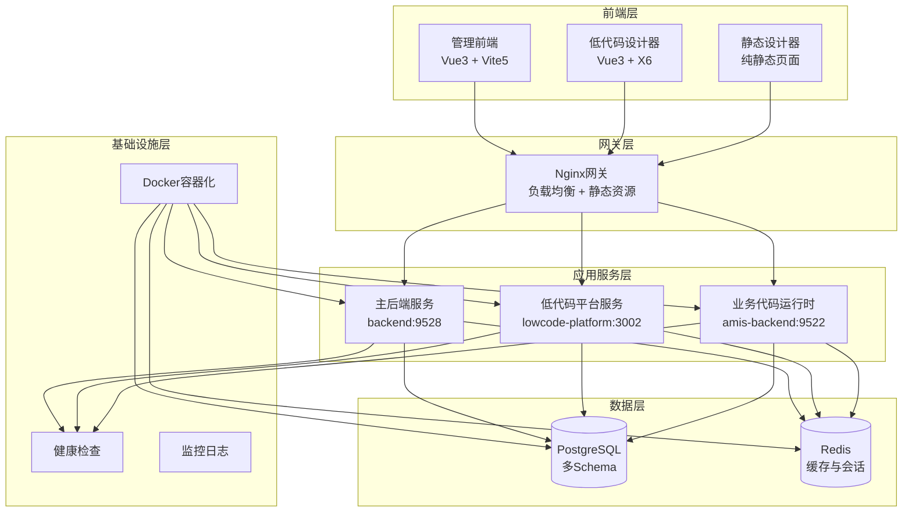
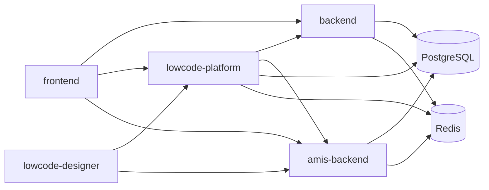

# SoybeanAdmin NestJS 项目总体架构分析

## 📋 项目概述

SoybeanAdmin NestJS 是一个基于现代技术栈的全栈低代码管理平台，采用 Monorepo 架构设计，集成了后台管理系统、低代码平台和可视化设计器。该项目为开发者提供了一个灵活、模块化、可扩展的企业级管理系统脚手架。

### 🎯 核心价值定位

- **全栈低代码平台**：提供从前端到后端的完整低代码开发解决方案
- **企业级管理系统**：内置权限管理、多租户、审计日志等企业级功能
- **微服务架构**：支持独立部署、扩展和维护的微服务架构
- **现代化技术栈**：基于 Vue3、NestJS、TypeScript 等现代技术

## 🏗️ 系统整体架构

### 架构风格
- **主架构模式**：微服务架构 + Monorepo 管理
- **设计模式**：DDD（领域驱动设计）+ CQRS（命令查询职责分离）
- **通信模式**：HTTP REST API + 事件驱动
- **数据存储**：多Schema数据库设计 + Redis缓存

### 核心组件架构图



## 🗂️ 项目结构分析

### Monorepo 布局

```
soybean-admin-nestjs/
├── 🖥️ 前端应用
│   ├── frontend/                    # 主管理系统前端 (Vue3)
│   ├── lowcode-designer/           # 低代码可视化设计器
│   └── static-designer/            # 静态设计器页面
├── ⚙️ 后端服务
│   ├── backend/                    # 主后端服务 (NestJS)
│   ├── lowcode-platform-backend/  # 低代码平台核心服务
│   └── amis-lowcode-backend/       # 生成代码运行时服务
├── 🚀 部署配置
│   ├── deploy/                     # 数据库初始化脚本
│   ├── scripts/                    # 自动化脚本
│   └── docker-compose.yml          # 容器编排配置
├── 📚 共享资源
│   ├── shared/                     # 跨服务共享模块
│   └── examples/                   # 业务场景示例
└── 📋 文档配置
    ├── .qodo/                      # 项目文档
    └── docs/                       # 技术文档
```

### 核心模块职责

| 模块 | 端口 | 主要职责 | 技术栈 |
|------|------|----------|--------|
| **frontend** | 9527 | 企业管理系统前端界面 | Vue3 + Vite5 + TypeScript |
| **lowcode-designer** | 9555 | 低代码可视化设计器 | Vue3 + AntV X6 |
| **backend** | 9528 | 主业务后端服务 | NestJS + Prisma + PostgreSQL |
| **lowcode-platform** | 3002 | 低代码平台核心引擎 | NestJS + DDD + CQRS |
| **amis-backend** | 9522 | 生成代码运行时环境 | NestJS + 动态模块 |

## 🔧 技术栈详解

### 前端技术栈
- **框架**: Vue 3.5.16 (Composition API)
- **构建工具**: Vite 6.3.5 (ESBuild)
- **语言**: TypeScript 5.8.3
- **状态管理**: Pinia 3.0.3
- **UI组件**: Naive UI 2.41.1 + UnoCSS
- **图表**: ECharts 5.6.0
- **可视化**: AntV X6 2.18.1 (流程图设计器)
- **国际化**: Vue I18n 11.1.5

### 后端技术栈
- **框架**: NestJS 11.0.12
- **语言**: TypeScript 5.8.2
- **Web服务器**: Fastify 5.2.2
- **ORM**: Prisma 6.5.0
- **数据库**: PostgreSQL 16.3 (多Schema设计)
- **缓存**: Redis 7.2.0
- **认证**: JWT + Passport
- **文档**: Swagger/OpenAPI
- **测试**: Jest 29.7.0

### 基础设施技术栈
- **容器化**: Docker + Docker Compose
- **数据库连接池**: PgBouncer 1.23.1
- **进程管理**: PM2
- **日志**: Winston + 文件轮转
- **监控**: 自定义健康检查 + 指标收集
- **代理**: Nginx (负载均衡)

## 🗄️ 数据库架构设计

### 多Schema架构
```sql
-- 数据库: soybean-admin-nest-backend
├── 📊 Schema: backend        # 主业务数据
├── 🔧 Schema: lowcode       # 低代码平台数据  
└── 🎯 Schema: amis          # 生成代码业务数据
```

### 核心数据表结构

#### Backend Schema (主业务)
```sql
-- 用户权限系统
sys_user              # 系统用户
sys_role              # 角色管理
sys_user_role         # 用户角色关联
sys_menu              # 菜单权限
sys_role_menu         # 角色菜单权限
casbin_rule           # Casbin权限规则

-- 系统管理
sys_domain            # 域管理
sys_organization      # 组织架构
sys_tokens            # 登录令牌
sys_login_log         # 登录日志
sys_operation_log     # 操作审计日志

-- 多租户支持
enterprise            # 企业信息
tenant                # 租户管理
app_space             # 应用空间
user_group            # 用户组
plan                  # 订阅计划

-- 低代码页面
sys_lowcode_page      # 低代码页面
sys_lowcode_page_version # 页面版本管理
```

#### Lowcode Schema (低代码平台)
```sql
-- 项目管理
lowcode_projects      # 低代码项目
lowcode_entities      # 业务实体
lowcode_fields        # 实体字段
lowcode_relations     # 实体关系

-- API配置
lowcode_api_configs   # API配置
lowcode_apis          # API定义
lowcode_queries       # 查询配置

-- 代码生成
lowcode_code_templates # 代码模板
lowcode_template_versions # 模板版本
lowcode_codegen_tasks # 代码生成任务

-- 部署管理
lowcode_project_deployments # 项目部署记录
lowcode_entity_layouts # 实体布局信息
```

### 数据关系设计
- **多租户隔离**: 通过 tenantId 实现数据隔离
- **软删除**: 关键数据支持软删除机制
- **审计字段**: 统一的 createdAt/updatedAt/createdBy 字段
- **版本控制**: 支持页面和模板的版本管理

## 🔄 服务间通信架构

### 通信模式
1. **HTTP API**: 主要的服务间通信方式
2. **事件驱动**: 基于 EventEmitter 的异步事件处理
3. **数据同步**: 定时任务同步数据状态
4. **健康检查**: 服务间的健康状态监控

### API 网关设计
```
客户端请求 → Nginx → 服务路由
├── /api/v1/*          → backend:9528
├── /lowcode/api/v1/*  → lowcode-platform:3002
└── /amis/api/v1/*     → amis-backend:9522
```

### 服务依赖关系


## 🔒 安全架构设计

### 认证授权机制
- **JWT认证**: 统一的JWT令牌认证
- **刷新令牌**: 支持令牌刷新机制
- **RBAC权限**: 基于角色的访问控制
- **Casbin集成**: 灵活的权限策略引擎
- **多租户隔离**: 租户级别的数据隔离

### 安全防护措施
- **CORS配置**: 跨域请求控制
- **Helmet防护**: HTTP安全头配置
- **速率限制**: API请求频率限制
- **输入验证**: 严格的数据验证机制
- **SQL注入防护**: Prisma ORM自动防护

## 🚀 部署架构设计

### 容器化部署
```yaml
# docker-compose.yml 架构
services:
  frontend:9527        # 前端管理系统
  lowcode-designer:9555 # 低代码设计器
  backend:9528         # 主后端服务
  lowcode-platform:3002 # 低代码平台
  amis-backend:9522    # 业务代码运行时
  postgres:25432       # PostgreSQL数据库
  pgbouncer:6432       # 数据库连接池
  redis:26379          # Redis缓存
```

### 环境隔离
- **开发环境**: Docker Compose 本地开发
- **测试环境**: 支持独立的测试配置
- **生产环境**: 可扩展的生产部署方案

### 资源配置优化
- **内存限制**: 合理的内存使用限制
- **CPU配额**: CPU使用配额分配
- **存储挂载**: 持久化数据存储
- **网络隔离**: 服务间网络隔离

## 📈 可扩展性设计

### 水平扩展能力
- **服务无状态**: 所有服务设计为无状态
- **数据库连接池**: PgBouncer连接池管理
- **缓存集群**: Redis集群支持
- **负载均衡**: Nginx负载均衡配置

### 模块化设计
- **领域边界清晰**: DDD领域模型设计
- **模块独立**: 各业务模块独立部署
- **插件化架构**: 支持功能插件扩展
- **模板系统**: 可扩展的代码生成模板

## 🔍 性能优化策略

### 数据库优化
- **索引设计**: 关键字段索引优化
- **查询优化**: Prisma查询优化
- **连接池**: 数据库连接池管理
- **分页设计**: 高效的分页查询

### 缓存策略
- **Redis缓存**: 热点数据缓存
- **会话管理**: 用户会话缓存
- **查询缓存**: 查询结果缓存
- **分布式锁**: Redis分布式锁

### 前端优化
- **代码分割**: 路由级别代码分割
- **懒加载**: 组件按需加载
- **构建优化**: Vite构建优化
- **CDN加速**: 静态资源CDN

## 🎯 项目特色亮点

### 低代码能力
1. **可视化设计器**: 拖拽式实体关系设计
2. **代码自动生成**: 基于模板的代码生成
3. **实时预览**: 代码生成实时预览
4. **模板系统**: 可扩展的模板引擎

### 企业级特性
1. **多租户架构**: 完整的多租户支持
2. **权限管理**: 细粒度的权限控制
3. **审计日志**: 完整的操作审计
4. **监控告警**: 系统健康监控

### 开发体验
1. **类型安全**: 全链路TypeScript
2. **API文档**: 自动生成的API文档
3. **测试覆盖**: 完整的测试体系
4. **热重载**: 开发环境热重载

### 运维友好
1. **容器化**: 完整的Docker支持
2. **健康检查**: 服务健康状态监控
3. **日志管理**: 结构化日志输出
4. **指标收集**: 系统指标监控

## 🔮 技术发展趋势

### 当前技术水平
- 基于最新的Vue3 Composition API
- 采用现代的NestJS微服务架构
- 使用类型安全的Prisma ORM
- 集成最新的Docker容器化技术

### 未来扩展方向
1. **云原生**: Kubernetes部署支持
2. **微前端**: 前端微服务架构
3. **事件溯源**: 事件驱动架构升级
4. **AI集成**: 智能代码生成能力

这个项目代表了现代企业级应用开发的最佳实践，融合了低代码理念与传统软件工程的优势，为开发者提供了一个功能强大、架构清晰、易于扩展的开发平台。