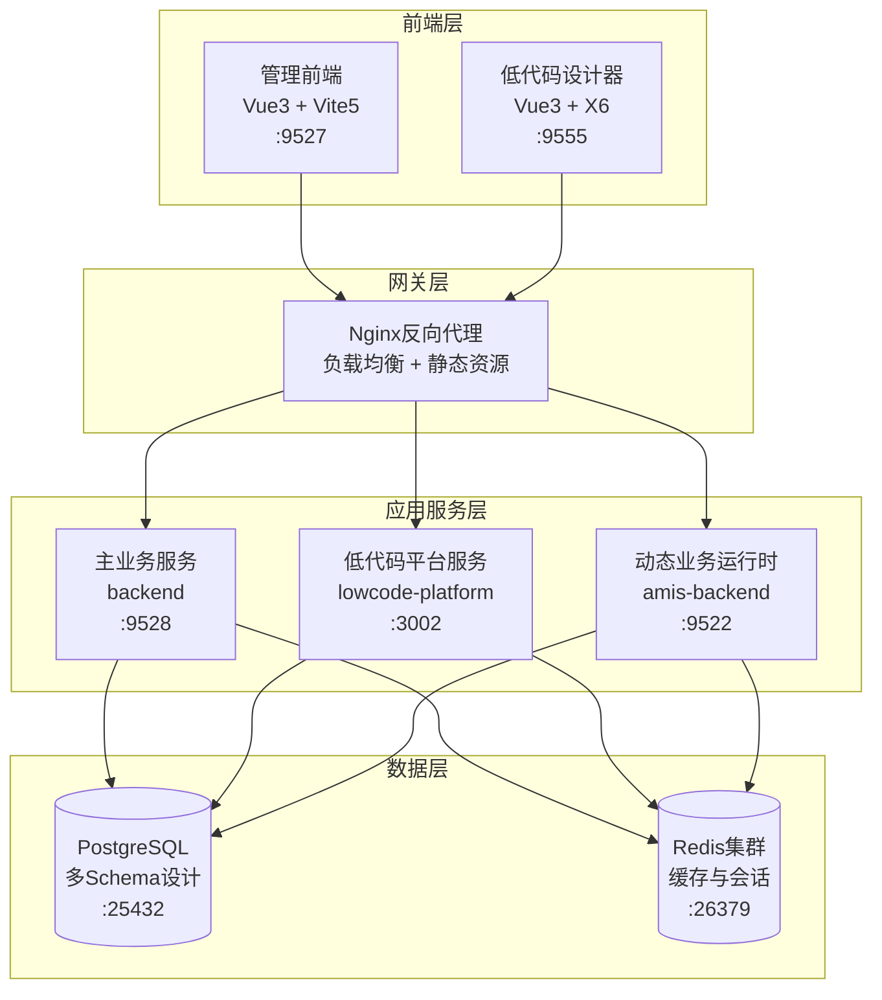

# SoybeanAdmin NestJS 微服务架构与通信设计

## 🏗️ 微服务架构概览

### 服务拆分策略

SoybeanAdmin NestJS 采用**业务域驱动的微服务拆分**，每个服务负责特定的业务领域：



### 服务职责划分

| 服务名称 | 端口 | 核心职责 | 业务边界 |
|---------|------|----------|----------|
| **backend** | 9528 | 企业管理系统核心业务 | 用户管理、权限控制、多租户、审计日志 |
| **lowcode-platform** | 3002 | 低代码平台核心引擎 | 项目管理、实体建模、代码生成、模板管理 |
| **amis-backend** | 9522 | 动态业务代码运行时 | 生成代码执行、动态API、业务数据处理 |

## 🔄 服务间通信架构

### 通信模式选择

#### 1. 同步通信 - HTTP REST API
**适用场景**: 主要的服务间调用，需要即时响应
```typescript
// 服务间HTTP通信示例
@Injectable()
export class ServiceCommunicationService {
  constructor(private readonly httpService: HttpService) {}

  async callLowcodePlatform(endpoint: string, data?: any) {
    const baseUrl = this.configService.get('LOWCODE_PLATFORM_URL');
    return this.httpService.post(`${baseUrl}${endpoint}`, data).toPromise();
  }

  async callAmisBackend(endpoint: string, data?: any) {
    const baseUrl = this.configService.get('AMIS_BACKEND_URL');
    return this.httpService.post(`${baseUrl}${endpoint}`, data).toPromise();
  }
}
```

#### 2. 异步通信 - 事件驱动架构
**适用场景**: 状态变更通知，不需要即时响应
```typescript
// 事件发布订阅示例
@Injectable()
export class ProjectEventService {
  constructor(private eventEmitter: EventEmitter2) {}

  // 发布项目部署事件
  publishProjectDeployed(projectId: string, port: number) {
    this.eventEmitter.emit('project.deployed', {
      projectId,
      port,
      timestamp: new Date()
    });
  }

  // 订阅项目部署事件
  @OnEvent('project.deployed')
  handleProjectDeployed(payload: any) {
    // 更新部署状态，通知相关服务
  }
}
```

### API网关路由设计

```nginx
# Nginx 路由配置
upstream backend_service {
    server backend:9528;
}

upstream lowcode_platform_service {
    server lowcode-platform:3002;
}

upstream amis_backend_service {
    server amis-backend:9522;
}

server {
    listen 80;
    
    # 主业务API路由
    location /api/v1/ {
        proxy_pass http://backend_service;
        proxy_set_header Host $host;
        proxy_set_header X-Real-IP $remote_addr;
    }
    
    # 低代码平台API路由
    location /lowcode/api/v1/ {
        rewrite ^/lowcode/api/v1/(.*) /api/v1/$1 break;
        proxy_pass http://lowcode_platform_service;
    }
    
    # 动态业务API路由
    location /amis/api/v1/ {
        rewrite ^/amis/api/v1/(.*) /api/v1/$1 break;
        proxy_pass http://amis_backend_service;
    }
    
    # 前端静态资源
    location / {
        proxy_pass http://frontend:80;
    }
}
```

## 🔐 服务认证与授权

### 统一JWT认证策略

#### JWT令牌设计
```typescript
interface JWTPayload {
  sub: string;          // 用户ID
  username: string;     // 用户名
  domain: string;       // 域
  tenantId?: string;    // 租户ID
  roles: string[];      // 角色列表
  permissions: string[]; // 权限列表
  iat: number;          // 签发时间
  exp: number;          // 过期时间
}
```

#### 服务间认证中间件
```typescript
@Injectable()
export class ServiceAuthMiddleware implements NestMiddleware {
  constructor(
    private jwtService: JwtService,
    private configService: ConfigService
  ) {}

  use(req: Request, res: Response, next: NextFunction) {
    const token = this.extractTokenFromHeader(req);
    
    if (token) {
      try {
        const payload = this.jwtService.verify(token, {
          secret: this.configService.get('JWT_SECRET')
        });
        
        // 设置用户上下文
        req['user'] = payload;
        req['tenantId'] = payload.tenantId;
        
      } catch (error) {
        throw new UnauthorizedException('Invalid token');
      }
    }
    
    next();
  }
}
```

### 权限控制策略

#### Casbin权限模型统一
```conf
# RBAC权限模型 (model.conf)
[request_definition]
r = sub, obj, act, domain

[policy_definition]
p = sub, obj, act, domain

[role_definition]
g = _, _, _
g2 = _, _, _

[policy_effect]
e = some(where (p.eft == allow))

[matchers]
m = g(r.sub, p.sub, r.domain) && r.obj == p.obj && r.act == p.act && r.domain == p.domain
```

#### 跨服务权限验证
```typescript
@Injectable()
export class CrossServiceAuthGuard implements CanActivate {
  constructor(
    private enforcer: Enforcer,
    private reflector: Reflector
  ) {}

  async canActivate(context: ExecutionContext): Promise<boolean> {
    const request = context.switchToHttp().getRequest();
    const user = request.user;
    
    if (!user) return false;
    
    // 获取权限要求
    const requiredPermission = this.reflector.get<string>(
      'permission',
      context.getHandler()
    );
    
    if (!requiredPermission) return true;
    
    // 验证权限
    return this.enforcer.enforce(
      user.sub,
      requiredPermission,
      'read',
      user.domain
    );
  }
}
```

## 📊 数据一致性保障

### 分布式事务处理

#### Saga模式实现
```typescript
@Injectable()
export class ProjectDeploymentSaga {
  constructor(
    private codeGenerationService: CodeGenerationService,
    private deploymentService: DeploymentService,
    private eventBus: EventBus
  ) {}

  @Saga()
  async handleProjectDeployment(command: DeployProjectCommand) {
    return [
      // 步骤1: 生成代码
      new GenerateCodeCommand(command.projectId),
      // 步骤2: 构建项目
      new BuildProjectCommand(command.projectId),
      // 步骤3: 部署服务
      new DeployServiceCommand(command.projectId),
      // 步骤4: 更新状态
      new UpdateDeploymentStatusCommand(command.projectId, 'DEPLOYED')
    ];
  }

  @SagaOrchestrationStart()
  async generateCode(command: GenerateCodeCommand) {
    try {
      await this.codeGenerationService.generateProject(command.projectId);
      return new GenerateCodeSucceededEvent(command.projectId);
    } catch (error) {
      return new GenerateCodeFailedEvent(command.projectId, error.message);
    }
  }
}
```

### 数据同步策略

#### 最终一致性实现
```typescript
@Injectable()
export class DataSyncService {
  constructor(
    private eventEmitter: EventEmitter2,
    private schedulerRegistry: SchedulerRegistry
  ) {}

  // 定时数据同步
  @Cron('0 */5 * * * *') // 每5分钟执行一次
  async syncProjectData() {
    const projects = await this.getModifiedProjects();
    
    for (const project of projects) {
      await this.syncProjectToAmisBackend(project);
    }
  }

  // 实时数据同步
  @OnEvent('project.updated')
  async handleProjectUpdated(event: ProjectUpdatedEvent) {
    // 异步同步到Amis后端
    await this.syncProjectToAmisBackend(event.project);
    
    // 通知其他服务
    this.eventEmitter.emit('project.synced', {
      projectId: event.project.id,
      timestamp: new Date()
    });
  }
}
```

## 🚀 服务发现与负载均衡

### 健康检查机制

#### 统一健康检查接口
```typescript
@Controller('health')
export class HealthController {
  constructor(
    private prismaService: PrismaService,
    private redisService: RedisService,
    private httpService: HttpService
  ) {}

  @Get()
  async getHealth() {
    const checks = await Promise.allSettled([
      this.checkDatabase(),
      this.checkRedis(),
      this.checkDependentServices()
    ]);

    return {
      status: checks.every(check => check.status === 'fulfilled') ? 'healthy' : 'unhealthy',
      timestamp: new Date(),
      checks: {
        database: this.getCheckResult(checks[0]),
        redis: this.getCheckResult(checks[1]),
        services: this.getCheckResult(checks[2])
      }
    };
  }

  @Get('ready')
  async getReadiness() {
    // 检查服务是否准备好接受流量
    return {
      status: 'ready',
      timestamp: new Date()
    };
  }

  @Get('live')
  async getLiveness() {
    // 检查服务是否存活
    return {
      status: 'alive',
      timestamp: new Date()
    };
  }
}
```

### Docker容器编排

#### 服务依赖管理
```yaml
# docker-compose.yml 服务依赖配置
version: '3.8'

services:
  # 数据库服务 (最底层依赖)
  postgres:
    image: postgres:16.3
    healthcheck:
      test: ["CMD-SHELL", "pg_isready -U soybean"]
      interval: 10s
      timeout: 5s
      retries: 5

  redis:
    image: redis/redis-stack:7.2.0
    healthcheck:
      test: ["CMD", "redis-cli", "ping"]
      interval: 10s
      timeout: 5s
      retries: 5

  # 主业务服务
  backend:
    build: ./backend
    depends_on:
      postgres:
        condition: service_healthy
      redis:
        condition: service_healthy
    healthcheck:
      test: ["CMD", "curl", "-f", "http://localhost:9528/v1/health"]
      interval: 30s
      timeout: 10s
      retries: 3

  # 低代码平台服务
  lowcode-platform:
    build: ./lowcode-platform-backend
    depends_on:
      postgres:
        condition: service_healthy
      redis:
        condition: service_healthy
      backend:
        condition: service_healthy
    healthcheck:
      test: ["CMD", "curl", "http://localhost:3002/health"]
      interval: 30s
      timeout: 10s
      retries: 3

  # 动态业务运行时
  amis-backend:
    build: ./amis-lowcode-backend
    depends_on:
      postgres:
        condition: service_healthy
      redis:
        condition: service_healthy
    healthcheck:
      test: ["CMD", "curl", "-f", "http://localhost:9522/api/v1/health"]
      interval: 30s
      timeout: 10s
      retries: 3
```

## 📈 性能优化策略

### 缓存策略设计

#### 多级缓存架构
```typescript
@Injectable()
export class CacheManagerService {
  constructor(
    private redisService: RedisService,
    private cacheManager: Cache
  ) {}

  // L1缓存: 内存缓存 (进程级)
  async getFromL1Cache(key: string) {
    return this.cacheManager.get(key);
  }

  // L2缓存: Redis缓存 (服务级)
  async getFromL2Cache(key: string) {
    return this.redisService.get(key);
  }

  // 多级缓存获取策略
  async getCachedData(key: string, fetchFunction: () => Promise<any>) {
    // 尝试从L1缓存获取
    let data = await this.getFromL1Cache(key);
    if (data) return data;

    // 尝试从L2缓存获取
    data = await this.getFromL2Cache(key);
    if (data) {
      // 回填L1缓存
      await this.cacheManager.set(key, data, 300); // 5分钟
      return data;
    }

    // 从数据源获取
    data = await fetchFunction();
    
    // 同时更新L1和L2缓存
    await Promise.all([
      this.cacheManager.set(key, data, 300),
      this.redisService.setex(key, 1800, JSON.stringify(data)) // 30分钟
    ]);

    return data;
  }
}
```

### 连接池优化

#### 数据库连接池配置
```typescript
// Prisma连接池配置
datasource db {
  provider = "postgresql"
  url      = env("DATABASE_URL")
  
  // 连接池配置
  directUrl = env("DIRECT_DATABASE_URL")
  
  // 连接池参数
  pool_size = 20          // 连接池大小
  connection_limit = 100  // 最大连接数
  pool_timeout = 10       // 连接超时
}

// Redis连接池配置
@Module({
  imports: [
    CacheModule.registerAsync({
      imports: [ConfigModule],
      useFactory: async (configService: ConfigService) => ({
        store: redisStore,
        host: configService.get('REDIS_HOST'),
        port: configService.get('REDIS_PORT'),
        password: configService.get('REDIS_PASSWORD'),
        db: configService.get('REDIS_DB'),
        // 连接池配置
        maxRetriesPerRequest: 3,
        retryDelayOnFailover: 100,
        enableReadyCheck: true,
        lazyConnect: true,
        // 连接池大小
        family: 4,
        connectTimeout: 60000,
        commandTimeout: 5000
      }),
      inject: [ConfigService]
    })
  ]
})
export class CacheManagerModule {}
```

## 🔍 监控与日志

### 分布式链路追踪

#### 请求ID传播
```typescript
@Injectable()
export class RequestContextMiddleware implements NestMiddleware {
  use(req: Request, res: Response, next: NextFunction) {
    // 生成或获取请求ID
    const requestId = req.headers['x-request-id'] as string || 
                     this.generateRequestId();
    
    // 设置请求上下文
    req['requestId'] = requestId;
    res.setHeader('x-request-id', requestId);
    
    // 传播到下游服务
    this.propagateRequestContext(req);
    
    next();
  }

  private propagateRequestContext(req: Request) {
    // 在HTTP客户端请求中自动添加追踪头
    this.httpService.axiosRef.interceptors.request.use(config => {
      config.headers['x-request-id'] = req['requestId'];
      config.headers['x-service-name'] = process.env.SERVICE_NAME;
      return config;
    });
  }
}
```

### 服务监控指标

#### Prometheus指标收集
```typescript
@Injectable()
export class MetricsService {
  private httpRequestDuration = new prometheus.Histogram({
    name: 'http_request_duration_seconds',
    help: 'Duration of HTTP requests in seconds',
    labelNames: ['method', 'route', 'status']
  });

  private httpRequestTotal = new prometheus.Counter({
    name: 'http_requests_total',
    help: 'Total number of HTTP requests',
    labelNames: ['method', 'route', 'status']
  });

  recordRequest(method: string, route: string, status: number, duration: number) {
    this.httpRequestTotal.inc({ method, route, status: status.toString() });
    this.httpRequestDuration.observe({ method, route, status: status.toString() }, duration);
  }

  @Get('metrics')
  getMetrics() {
    return prometheus.register.metrics();
  }
}
```

## 🛡️ 容错与降级

### 熔断器模式

```typescript
@Injectable()
export class CircuitBreakerService {
  private circuits = new Map<string, CircuitBreaker>();

  getCircuitBreaker(serviceName: string) {
    if (!this.circuits.has(serviceName)) {
      const breaker = new CircuitBreaker(this.callService.bind(this, serviceName), {
        timeout: 5000,           // 5秒超时
        errorThresholdPercentage: 50,  // 50%错误率
        resetTimeout: 30000,     // 30秒后尝试恢复
        rollingCountTimeout: 10000,    // 10秒统计窗口
        rollingCountBuckets: 10  // 统计桶数量
      });

      breaker.fallback(() => this.getFallbackResponse(serviceName));
      this.circuits.set(serviceName, breaker);
    }

    return this.circuits.get(serviceName);
  }

  private getFallbackResponse(serviceName: string) {
    switch (serviceName) {
      case 'lowcode-platform':
        return { status: 'degraded', message: '低代码平台暂不可用' };
      case 'amis-backend':
        return { status: 'degraded', message: '业务服务暂不可用' };
      default:
        return { status: 'error', message: '服务不可用' };
    }
  }
}
```

### 优雅降级策略

```typescript
@Injectable()
export class DegradationService {
  constructor(
    private circuitBreakerService: CircuitBreakerService,
    private cacheService: CacheService
  ) {}

  async callWithDegradation<T>(
    serviceName: string,
    operation: () => Promise<T>,
    fallbackKey?: string
  ): Promise<T> {
    const breaker = this.circuitBreakerService.getCircuitBreaker(serviceName);

    try {
      return await breaker.fire();
    } catch (error) {
      // 尝试从缓存获取
      if (fallbackKey) {
        const cached = await this.cacheService.get(fallbackKey);
        if (cached) {
          return cached as T;
        }
      }

      // 返回降级响应
      throw new ServiceUnavailableException(`${serviceName} is currently unavailable`);
    }
  }
}
```

## 📋 总结

SoybeanAdmin NestJS的微服务架构具有以下特点：

### 架构优势
1. **清晰的服务边界**: 按业务域划分服务，职责明确
2. **统一的认证授权**: JWT + Casbin 的统一权限模型
3. **完善的容错机制**: 熔断器 + 降级策略
4. **高可用设计**: 健康检查 + 自动恢复

### 通信特点
1. **多种通信模式**: 同步HTTP + 异步事件
2. **统一的链路追踪**: 分布式请求追踪
3. **完善的监控体系**: 指标收集 + 日志聚合

### 扩展性设计
1. **水平扩展**: 无状态服务设计
2. **服务发现**: 基于容器编排的服务发现
3. **配置外部化**: 环境变量 + 配置中心

这个微服务架构为整个低代码平台提供了稳定、可扩展、高性能的技术基础。