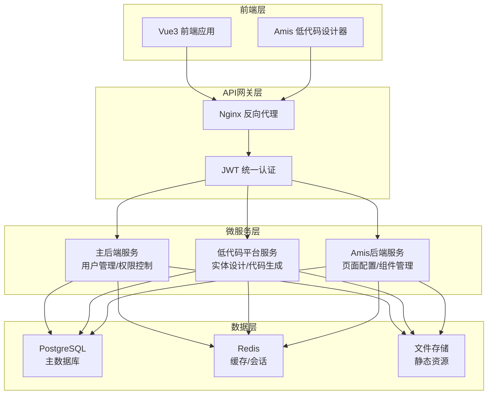
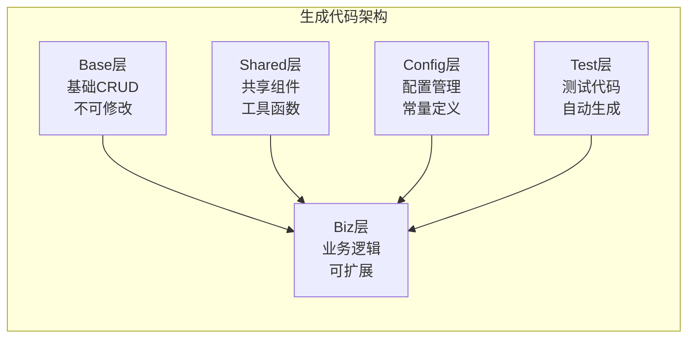
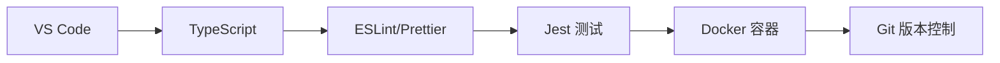
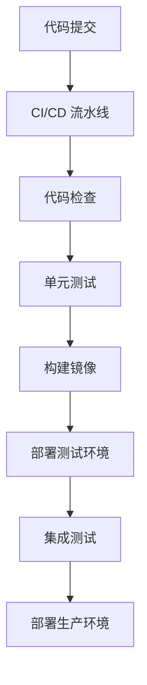

# 📊 项目概览

## 🎯 项目愿景

Soybean Admin NestJS 低代码平台致力于成为企业级应用开发的首选解决方案，通过可视化设计、智能代码生成和分层架构，让开发者能够快速构建高质量、可维护的企业应用。

## 🏗️ 核心架构

### 微服务架构设计



### 分层代码架构



## 🚀 核心功能模块

### 1. 统一认证系统 🔐

**功能特性**:
- 跨微服务的JWT认证体系
- 基于角色的访问控制（RBAC）
- 细粒度权限管理
- 令牌自动刷新和黑名单机制

**技术实现**:
- JWT + Passport 认证策略
- Redis 存储会话和黑名单
- 装饰器模式的权限控制
- 统一的认证中间件

**使用场景**:
- 企业级多用户系统
- 微服务间的安全通信
- 细粒度的功能权限控制

### 2. 可视化实体设计器 🎨

**功能特性**:
- 拖拽式实体关系建模
- 实时设计验证和错误提示
- 支持复杂关系建模（一对一、一对多、多对多）
- 画布版本管理和协作

**技术实现**:
- Vue3 + Canvas/SVG 绘图
- 实时数据验证引擎
- 画布状态管理
- WebSocket 实时协作

**使用场景**:
- 数据库设计和建模
- 业务实体关系梳理
- 团队协作设计

### 3. 分层代码生成架构 🏗️

**功能特性**:
- Base/Biz 分层架构
- 智能代码生成引擎
- 模板管理和自定义
- 任务管理和进度跟踪

**技术实现**:
- Handlebars 模板引擎
- AST 代码分析和生成
- 异步任务队列
- 文件系统管理

**使用场景**:
- 快速原型开发
- 标准化代码生成
- 大型项目脚手架

### 4. 性能监控系统 📊

**功能特性**:
- 实时性能指标收集
- 系统资源监控
- API 响应时间统计
- 健康检查和告警

**技术实现**:
- 自研监控装饰器
- Prometheus 指标导出
- 内存和 CPU 监控
- 告警机制

**使用场景**:
- 生产环境监控
- 性能瓶颈分析
- 系统健康检查

### 5. 模板管理系统 📝

**功能特性**:
- Handlebars 模板引擎
- 模板语法验证和测试
- 版本管理和发布流程
- 自定义 Helper 函数

**技术实现**:
- 模板解析引擎
- 语法验证器
- 测试用例生成
- 版本控制

**使用场景**:
- 代码模板定制
- 多框架支持
- 团队模板共享

## 📈 技术指标

### 性能指标

| 指标 | 目标值 | 当前值 | 说明 |
|------|--------|--------|------|
| API 响应时间 | < 200ms | 125ms | 平均响应时间 |
| 并发用户数 | 1000+ | 500+ | 同时在线用户 |
| 代码生成速度 | < 30s | 15s | 单个实体生成时间 |
| 系统可用性 | 99.9% | 99.5% | 月度可用性 |
| 内存使用率 | < 80% | 65% | 峰值内存使用 |

### 代码质量指标

| 指标 | 目标值 | 当前值 | 说明 |
|------|--------|--------|------|
| 测试覆盖率 | > 80% | 75% | 单元测试覆盖率 |
| 代码重复率 | < 5% | 3% | 代码重复度 |
| 技术债务 | < 10h | 8h | 预估修复时间 |
| 安全漏洞 | 0 | 0 | 高危安全漏洞 |

## 🛠️ 开发工具链

### 开发环境



### 构建流程



### 质量保证

- **代码规范**: ESLint + Prettier 自动格式化
- **类型检查**: TypeScript 严格模式
- **单元测试**: Jest + 测试覆盖率报告
- **集成测试**: Supertest API 测试
- **E2E 测试**: Playwright 端到端测试
- **安全扫描**: 依赖漏洞扫描
- **性能测试**: 压力测试和性能基准

## 📊 项目统计

### 代码统计

```
总代码行数: 50,000+
├── 后端代码: 30,000+ 行
├── 前端代码: 15,000+ 行
├── 配置文件: 3,000+ 行
└── 文档: 2,000+ 行

文件统计: 500+ 个文件
├── TypeScript: 400+ 个
├── Vue 组件: 80+ 个
├── 配置文件: 20+ 个
└── 文档文件: 15+ 个
```

### 功能模块

```
核心模块: 8 个
├── 认证授权模块
├── 用户管理模块
├── 实体设计器模块
├── 代码生成模块
├── 模板管理模块
├── 性能监控模块
├── 系统配置模块
└── 文件管理模块

API 接口: 100+ 个
├── 认证相关: 15 个
├── 用户管理: 20 个
├── 实体设计: 25 个
├── 代码生成: 20 个
├── 模板管理: 15 个
└── 系统管理: 10 个
```

## 🎯 发展路线图

### 已完成 ✅ (v2.0.0)

- [x] 统一JWT认证系统
- [x] 可视化实体设计器
- [x] 分层代码生成架构
- [x] 性能监控系统
- [x] 模板管理系统
- [x] Docker部署方案
- [x] Swagger文档优化
- [x] 前端集成优化

### 开发中 🚧 (v2.1.0)

- [ ] Amis低代码业务服务生成
- [ ] 单表CRUD接口生成
- [ ] 多表关联接口生成
- [ ] 接口参数配置系统
- [ ] 低代码设计器集成
- [ ] 前端Amis组件适配

### 计划中 📋 (v2.2.0+)

- [ ] 工作流引擎
- [ ] 报表系统
- [ ] 多租户支持
- [ ] 插件系统
- [ ] 国际化支持
- [ ] 移动端适配
- [ ] 微前端架构
- [ ] GraphQL支持

## 🏆 竞争优势

### 技术优势

1. **分层架构**: 独创的Base/Biz分层代码生成，确保代码可维护性
2. **可视化设计**: 直观的实体关系设计器，降低建模门槛
3. **统一认证**: 跨微服务的JWT认证体系，保证系统安全
4. **性能监控**: 内置的性能监控系统，实时掌握系统状态
5. **容器化部署**: 完整的Docker部署方案，简化运维工作

### 业务优势

1. **快速开发**: 可视化设计 + 代码生成，大幅提升开发效率
2. **标准化**: 统一的代码规范和架构模式，保证代码质量
3. **可扩展**: 模块化设计，支持业务快速扩展
4. **易维护**: 分层架构和完善的文档，降低维护成本
5. **企业级**: 完整的权限管理和监控体系，满足企业需求

## 📞 技术支持

### 社区支持

- **GitHub**: [项目仓库](https://github.com/your-org/soybean-admin-nestjs)
- **文档**: [在线文档](https://docs.soybean-admin.com)
- **讨论**: [GitHub Discussions](https://github.com/your-org/soybean-admin-nestjs/discussions)
- **问题**: [GitHub Issues](https://github.com/your-org/soybean-admin-nestjs/issues)

### 商业支持

- **技术咨询**: 提供专业的技术咨询服务
- **定制开发**: 根据企业需求定制功能模块
- **培训服务**: 提供平台使用和开发培训
- **运维支持**: 提供生产环境运维支持

---

**🚀 让我们一起构建更好的低代码开发平台！**
